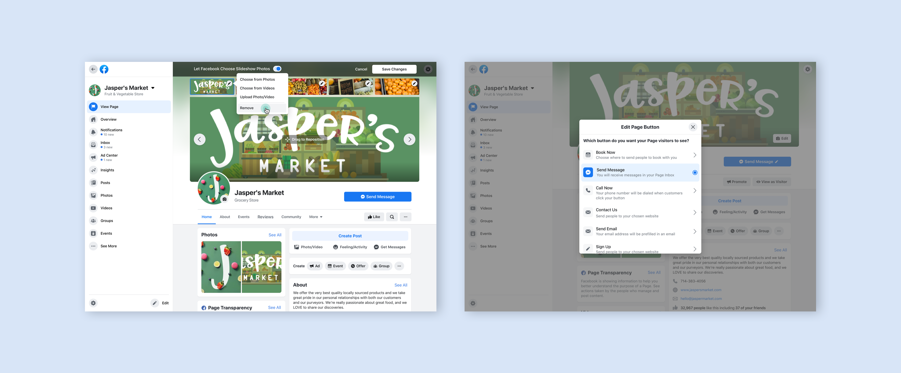
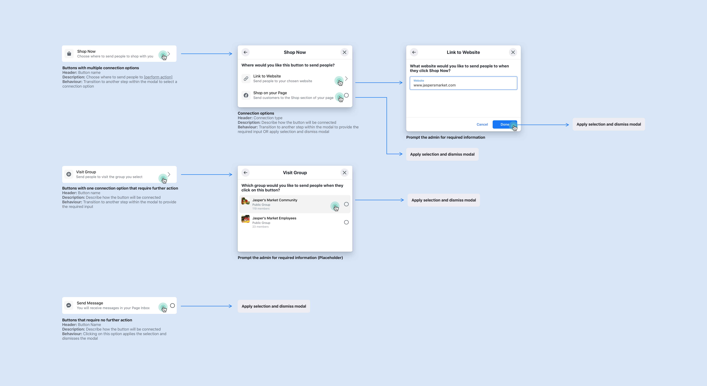
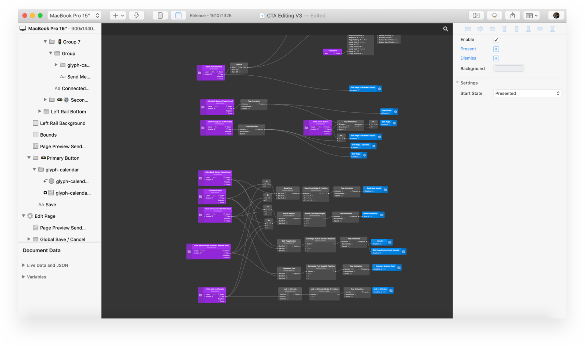

[[slug]]
| #Facebook Pages
| ### Product Design Intern, 2019

[[wideImage]]
| 

### Overview

Facebook Pages enables millions of small businesses to build communities, and meaningfully connect with their audiences.

For my product design internship at Facebook in the summer of 2019, I worked on the core web platform for Facebook Pages. I designed a new editing experience to help Facebook Page admins update their business information, which has since been launched as a part of the [Facebook.com](http://facebook.com) site-wide redesign. I also explored a welcome experience to introduce Facebook Pages to new users.

The focus of my internship was to define the direction of editing business information for Page admins. In particular, the experience of editing information about an admin's Page, such as the primary call-to-action button, the cover photo, and the profile picture. In addition, I tackled ways to introduce the Page admin interface to new users in order to improve their understanding of how our tools could be used to drive business success.

This project involved collaboration with our design systems team in order to achieve consistency in visual patterns and interactions across the product. It also involved collaboration with partner teams whose tools integrate into the core platform so we could design a solution that supported a range of diverse use cases.

 ## During my internship, I

- performed a comprehensive audit of existing user flows to gain an understanding of how we arrived at our current state, identified opportunities for improving the experience, and identified the stakeholders who would be affected by our team's changes
- prepared a script and prototype for testing design explorations with a small group of users, which informed us about their expectations and mental models in regards to editing Page information
- prototyped extensively and presented explorations to cross-functional teams and design peers
- worked with software engineers to ensure feasibility of implementation
- delivered design directions for editing Page CTAs, cover areas, and profile photos

[[wideImage]]
| 

- explored a welcome experience for new Pages users
- learned Origami, a prototyping tool I began using for the first time at Facebook.

[[wideImage]]
| 

For more information about this project, please contact me via email.
