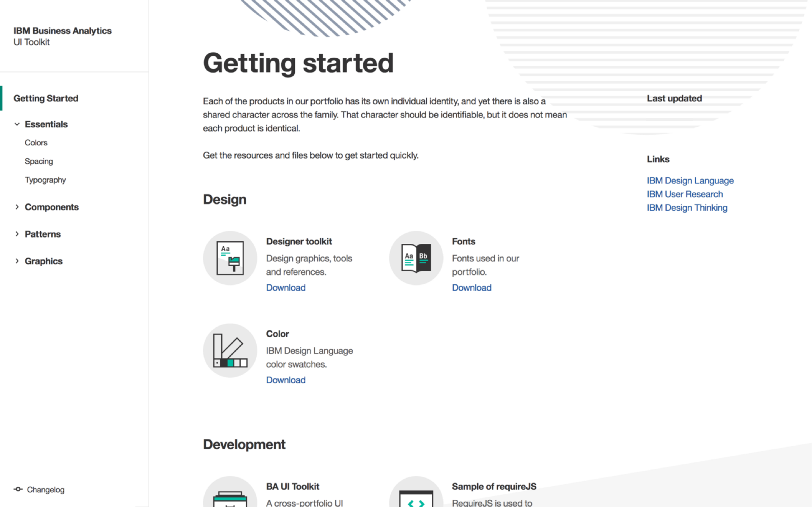

#IBM Business Analytics

[[wideImage]]
| 

## Overview

In the Fall of 2017, I moved from Vancouver to Toronto to join IBM Business Analytic’s design studio as a UX/UI Design Intern. I worked closely alongside my manager, Justin Godard, on both the design system team and the content navigation team.

During my time at IBM, I contributed to the maturation of the IBM Business Analytics design system, shipped improved designs to content navigation experiences, explored and prototyped designs in code for a home page experience. I learned an immense amount about the challenges associated with scaling a design system across a large team.

Due to confidentiality reasons, I can’t disclose details about my work at this time. However, the lessons I’ve learned over the course of 4 months at IBM can still be generalized. In no particular order, here are some of the things I’ve learned.

## Balancing consistency vs perfection in our design system
A frequent struggle for us when incorporating a new component into the design system was accounting for every single use case. To fully understand how a component was being used in the product, we would have to meet with different teams and learn about their specific needs. Our job was to abstract the component in a way that allowed for code reuse, but was flexible enough to account for all current and future usage. Often times, a single component would have a slightly different behavior in a different part of the product.

Did we want to be consistent? Or did we want the perfect solution for every single edge case and scenario? My design lead eventually helped me accept that creating the design system that worked for 80% of the team would be considered a win. For the remaining 20% of cases where the component wouldn’t be used, we discussed ways to modify the UI using other components that could still fulfill the same experience.

## Education is key to gaining adoption
It’s one thing to create a cohesive design system, it’s another to gain widespread adoption of the system across the organization. Providing the design files to the designers and coded components to the developers wasn’t enough. Bi-weekly meetings open to all product teams allowed us to give updates on our progress, and allowed the teams at large to give valuable feedback. Giving examples of how the design system would benefit each individual in their work was important for people to see the value of incorporating the system into their workflows.

As a designer, you get to take your concepts to high-fidelity faster.

As a developer, you don’t have to redevelop a component that you didn’t know already existed elsewhere in the product.

## Storytelling in design
My manager demonstrated how to use storytelling to your advantage during stakeholder meetings. Provide a strong context for your design exploration at the beginning of the meeting. Framing the discussion will help set expectations with regards to the scope, and the level of depth you’ve explored in your designs. Anytime the discussion would go off track, referring back to the original goal and user outcomes of the exploration can encourage relevant feedback.

## The power of prototypes in stakeholder discussions
During my time at IBM, I made a lot of prototypes. I began with using the tool that was most familiar to me, inVision. However, I soon realized inVision prototypes weren’t great for showing flows involving micro interactions or animations. So I started creating animated video prototypes in Keynote. These served as key talking points during stakeholder meetings.

## There’s no such thing as a minor component
When I was defining the behavior of components for our UI toolkit, it became clear that even the smallest components had a decent amount of complexity attached to them. Months later, I came across this article called [“There’s no such thing as minor design changes”](https://uxdesign.cc/theres-no-such-thing-as-minor-design-changes-18ee2bebeab4) that really rang true for me during my internship.

## Highlights of my internship
By the end of my work term, I was most proud of my contributions to the living, breathing component library for our suite of analytics products. I was also privileged enough to participate in various IBM design events. Some highlights outside of work were:

- Winning IBM’s student of the term award
- Winning the intern Halloween costume contest
- Quarterly design jams
- Attending the annual IBM Canada design conference in Markham

Thanks for reading! Please email me if you wish to know more about this project.

