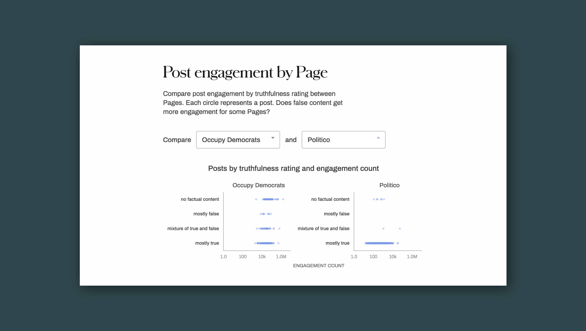
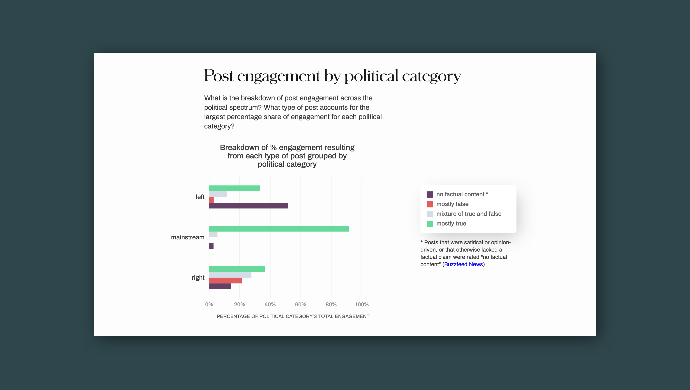
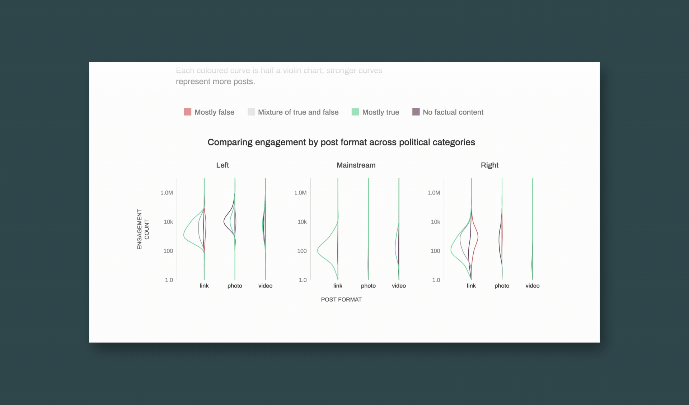
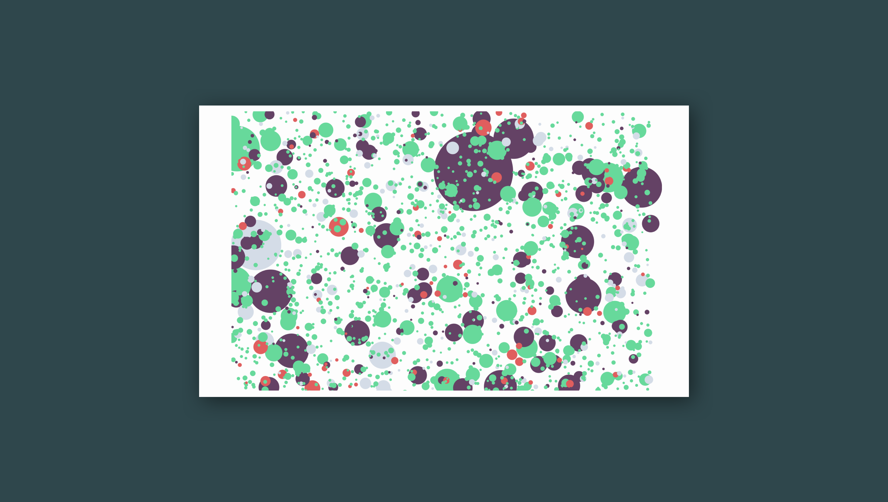

[[slug]]
| #Visualizing Political Posts
| ### Data viz design, D3.js

[[video]]
| <iframe src="https://player.vimeo.com/video/420109879" width="720" height="600" frameborder="0" allow="autoplay; fullscreen" allowfullscreen></iframe>

In a moment of what feels like overwhelming polarization in political media, my teammates and I wanted to create an interactive experience that explores the topic of truthfulness and political alignment on social media. For my final project in my "Topics in Computer Science - Information Visualization" course, I worked on a visualization that explores a dataset from 9 American political pages on Facebook from September 2016, around the time of some key political moments such as the first presidential debate.

**Duration:** 4 weeks  
**Team**: [Luce Liu](https://luceliu.com), [Amy Zhu](https://amy.zhucchini.ca)  
**Contributions**: Design, D3.js, HTML/CSS, JS

The visualization allows us to explore patterns concerning truthfulness ratings, engagement counts, and post formats from 2000+ posts from across the political spectrum. Our group was interested in the question "how does post truthfulness vary?" over variables such such as page, page category, number of total posts made by that page, and post format. We designed and coded a visualization using D3.js to help us explore these lines of inquiry.

## Dataset
We used a dataset provided by [BuzzFeed News](https://www.buzzfeednews.com/article/craigsilverman/partisan-fb-pages-analysis) that qualifies the extent of misleading information in shared by political Facebook pages. It analyzes about 2200 posts, which might be either photo, video, or external link, and characterizes their truthfulness (as attribute Rating, which is an ordinal variable ranging from Mostly True, Mixture of True and False, Mostly False, or No Factual Content). Mixture of True and False describes posts that combine verifiable information with speculative claims or uncorroborated claims, and No Factual Content refers to posts that are opinion, satire, or otherwise do not make any claims that are factually substantiated. These ratings were produced by raters from BuzzFeed News.

## Goals and tasks
We identified the key tasks that we hoped our visualization could facilitate:
1. Explore whether publishers of political content on Facebook are being truthful or not in their content.
2. Compare different Facebook Pages in order to understand whether a publisher's position on the political spectrum (left, centre, right) has any relation with how truthful their content is.
3. Sort pages to understand the relationship between how much they post and how many of their posts are a certain ranking.
4. Summarize the relationship between post format or post rating and engagement across page categories.
5. Juxtapose two specific Pages, showing the effect of truthfulness rating on engagement for two different pages.
6. Query each post and its attributes in depth and at a fine-grained level (even allowing users to look at the original post itself, if available).

## Exploring post engagement

[[wideImage]]
|

### Overview

The bubble visualization allows the user to explore the distribution of posts, post engagement, and truthfulness across all posts from our dataset. The task at hand is not to understand the exact proportions of accurate versus inaccurate posts, since other form factors such as a grouped bar plot are able to address that task more effectively. Rather, this visual allows the user to explore individual posts and identify outliers. Upon clicking on a circle, a link to the original Facebook post is opened in a new tab so the user can understand the contents of the post for themselves.

### Area

The area of each circle encodes the total engagement count for that post. Total engagement count was a derived variable calculated by summing up counts of shares, comments and reactions for each post. The domain of engagement count ranged from under a hundred to over a million. Although it's difficult to discern small differences in area between circles due to area being a less effective perceptive channel than say, length, this visualization allows the user to easily spot outliers and understand the overall composition of a Page or political category's posts.

### Colour

Hue encodes the truthfulness rating for that post, indicating whether it was rated mostly false, true, a mixture of both, or an opinion/satirical post. We chose hue to encode the rating because the cardinality of the attribute was low, and because certain hues already semantically denote the categories we working with (green for true, red for false, grey for neutral). The decision to represent "no factual content" posts using purple comes from its closeness in hue to red, without having the negative, or false connotation associated with red. Note that "no factual content" does not mean that the post was false, but that it contained content that was deemed to be entirely opinion or satire.

## Page accuracy

[[wideImage]]
|

### Overview
We also wanted to explore the interplay between post quantity and truthfulness. We chose a novel form factor, which lists each page with two point marks size-coded to represent the percentage of posts of a certain Rating made by a Page against all posts for that Page (and colour-coded to represent Rating as above). These pages are then ranked by the Rating count descending. This helps convey the relationship between how much each page posts and how much of those are truthful.

Because circle area and radius are somewhat difficult to compare perceptually, we've used a square root scale for the size, and included numbers where possible, so that readers can ground themselves with a concrete sense of magnitude.

### Interactions
For the purpose of comparing across all four Rating types, we added tabs to switch between toggle between displaying different Ratings. This also automatically reorders the elements such that the descending ranking is preserved. Therefore, which Pages have the greatest accuracy/inaccuracy/etc is always perceptually easy to understand.

To better relate this novel ranking visualization with our stacked bar, we added bidirectional highlighting at the page level when hovering over page names, so that the audience can quickly view at which ranking a page's breakdown stands, or so that they can easily explore the truthfulness breakdown of a given page. Since length on an unaligned scale is not the most perceptually effective, the bidirectional linking from stacked bar chart to ranking chart helps verify a user's impression of where a page is ranked side-by-side with a particular truthfulness rating.

## Comparing engagement and truthfulness between Pages

[[wideImage]]
|

### Overview
The small multiples visualization lets a user compare the truthfulness rating and engagement count of posts made by any two pages, side by side. Each point on a scatter plot is a point mark that represents a single post. This visualization enables the task we set out to facilitate: at a quick glance, the user can see how much engagement a page's posts receive and how truthful each post is. Since the points are rendered at 50% opacity, it's possible to see concentrations of many points, as well as outliers.

Position on horizontal scale (i.e. x-axis) encodes the total engagement for each post—how many reactions, comments and shares it received. We used a log scale for this to account for the previously mentioned wide domain of this quantitative data (less than one hundred to over one million), allowing us to fit all of our points on the same axis, but also allowing for the user to quickly spot outliers.

## Breakdown of engagement across political categories

[[wideImage]]
|

### Overview
The grouped bar shows the distribution of engagement counts across all truthfulness rankings, for each political category. This chart reinforces certain notable phenomena shown in the bubble visualization, e.g. a little over 50% of all left-page post engagement occurs with posts that are deemed to have "no factual content," and the political category with the highest percentage of engagement resulting from "mostly false" content is the right. By aggregating the data, these kinds of takeaways are simplified to be more readily digested by the viewer.

## Engagement across post format and political category

[[wideImage]]
|

### Overview

Originally, we had planned on using a small multiple scatterplots to visualize the three dimensions of post format, rating, and page category (left, mainstream, or right) against engagement; however, the excess of points aggregated, combined with the limited screen space we had to show all three scatterplots side by side meant that the colours representing rating became muddied. It became difficult to meaningfully distinguish the colours of the points. We decided to create a visualization that would still capture the shape of engagement trends.

To this end, we used an asymmetrical violin plot, with each rating split into its own half-violin. The width (i.e. magnitude) of the violin represents a count of how many posts achieved a certain engagement count. While the grouped bar provides a general breakdown and overview of post engagement, the violin plot also uncovers distributions of how many posts got how much engagement. Is it that there are a lot of posts getting a constant number of engagement? Maybe a few posts getting a huge spike? Do some post formats succeed in capturing engagement more than others?

### Insights

This chart does reveal some interesting trends across page categories — for example, there are far fewer videos posted in general, and photos that contain no factual content are more common than any other kind. Also, for left and right Pages, posts with no factual content, though rarer, tended to get higher engagement. In fact, more politically partisan pages tend to get less engagement with mostly true posts, whereas mainstream links achieve an almost perfect Gaussian distribution (on a log scale) of engagement, with a lot of links hitting an engagement count of around 100.

### Room for improvement
Since this is a rather uncommon form factor that people may be unfamiliar with, given more time, we would have labelled the x-axis for each plot with the engagement count, and experimented with how many ticks to display. From a design perspective, this is a challenge given the limited screen space.

## Reflection

Unlike most of my other design projects, the primary goal of this project was to develop my technical skills in implementing visualizations using D3.js. This was the first time my group members and I had ever built a data visualization from ideation to implementation. As a result, most of the challenges we encountered were technical ones.

[[wideImage]]
|

### Responsiveness

Making our visualizations responsive to some extent was our biggest obstacle. A workaround we employed in order to make the rendering of the chart titles somewhat responsive was to render them using HTML text rather than SVG, as was shown during our D3 tutorials. This mitigated the problem of SVG being unable to wrap the text appropriately given the screen size. After taking into consideration the changes required to support meaningful mobile interactions, as well as the short time frame we were working with, we decided to scrap the possibility of making the visualizations mobile responsive for the purposes of this project.

### Duplicate code

By the time we had completed our project, there were several instances of duplicated code being used to render the interactive tabs. If I had to redo this project from the beginning, I would've componentized the UI elements in addition to the visualizations themselves. Also, I would've liked to use CSS variables or preprocessor for all the different styling that was applied to the axes, ticks, labels, and typography for consistency and ease of reuse. When we started combining our visualizations, the amount of styles we had became difficult to manage.

### Animation performance

Finally, I would've wanted to look into improving the performance of the bubble visualization. Rendering over 2000 data points at once causes a noticeable lag in the enter and update transitions. An alternative design that split up the data points into separate, smaller views by some meaningful categorical dimension such as political category could've mitigated this issue. However, it would have reduced the visual impact of being able to perceive all the data points at once, and gauge their relative sizes.

### Summary of insights

Our team's visualization efforts mirror the conclusions of the original [Buzzfeed News](https://www.buzzfeednews.com/article/craigsilverman/partisan-fb-pages-analysis) article. Through this exploration, it appears that the non-partisan Facebook Pages included in the dataset shared the least amount of false content. In contrast, partisan left Pages post the most satirical or opinion-driven content, which also makes up the largest percentage of their combined engagement. The political category with the most false content was the partisan right.
