[[slug]]
| #Exploring trends with Visier People
| ### UX Designer (Co-op), 2018

[[video]]
| <iframe src="https://player.vimeo.com/video/290106378" width="720" height="600" frameborder="0" allow="autoplay; fullscreen" allowfullscreen></iframe>

Disclaimer: This case study is my own and the thoughts expressed here are not necessarily representative of Visier. All data shown is fictional.

## Overview

Visier People uses workforce data to allow organizations to explore, visualize, and share insights so businesses can make critical decisions about hiring, retaining, and developing their workforce.

**Design team**: Anthony Remizov (design mentor), Aileen Wang (motion design)

**Timeline**: 2 months of an 8-month internship

**My role**: User experience and data visualization design. I was responsible for the end-to-end user flows on both Visier People’s web and mobile experience. I worked on the area of the product which focuses on free-form data exploration. For this experience, I was in charge of defining the user flows and form factors, creating high fidelity designs, and researching user perceptions of time-based visuals.

### Problem
[[emphasisText]]
| Organizations need a way to explore business questions relating to the change in magnitude of a metric over time.

### Goals
[[emphasisText]]
| 1. Design a resilient visualization that can answer those questions.
| 2. Guide both HR and analyst users in making meaningful comparisons with their data, and capturing visuals that tell stories about the insights they discover.

## What is the value of this visualization?

### Showing data over time

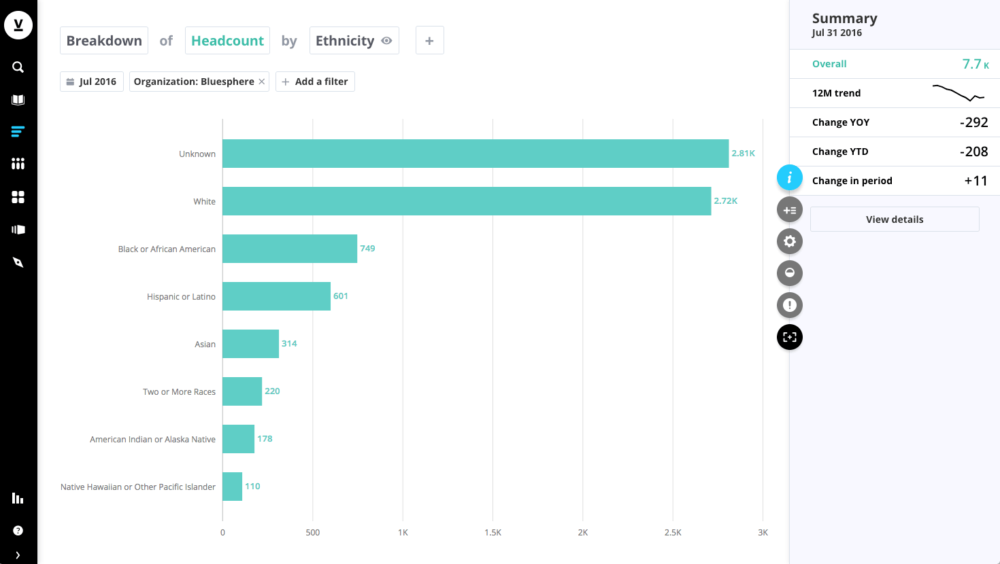

Before this was added to Visier People, the only bar chart that existed in the app was horizontal. By convention, time is depicted flowing from left to right rather than up to down.

### Exploring magnitude over time

[[wideImage]]
|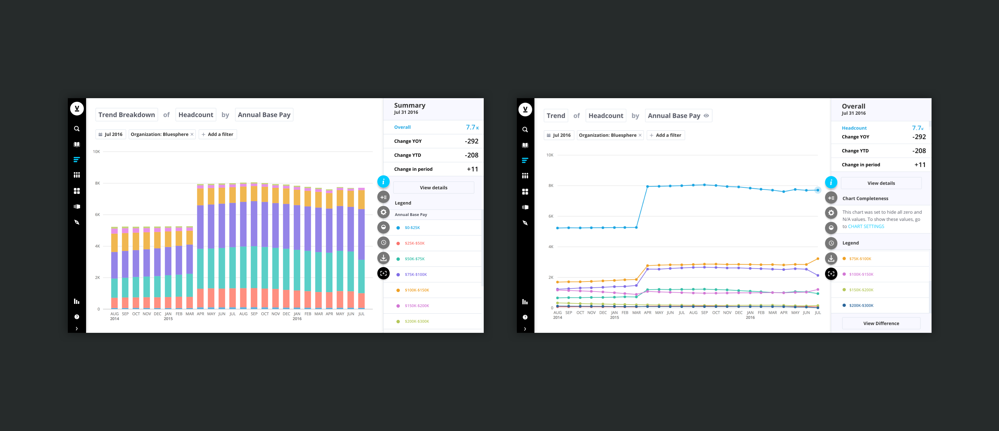

Among our users, a common analytical question is to understand the magnitude of a metric over time. While a trend chart shows the slope of the changes, it lacks the ability to communicate the magnitude and the composition of that magnitude.

## Defining the experience

### The goal is not to build charts

[[wideImage]]
|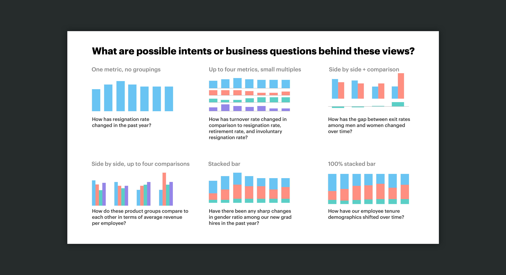

What distinguishes Visier from traditional analytics tools out there is that it shifts the focus from learning the complexities of the tool itself to answering business questions. HR workers and CHROs don’t use the product because they want to build the most beautiful charts or build 100 types of charts — they use it to understand the trends and relationships behind their workforce. Most of our users are working in HR, while some are data analysts. The average user without an analytics background may not know, or care when to use a pie chart vs a bar chart.

### Constraining the grouping to time-only
If the goal is to guide the user in the direction of using the product to answer business questions, rather than fiddling with form factors, then constraining this form factor to certain types of data is a step in the right direction. Horizontally oriented bar charts have significant advantages over vertically oriented ones. A quick google search reveals the pitfalls of using the vertical orientation.

[[wideImage]]
|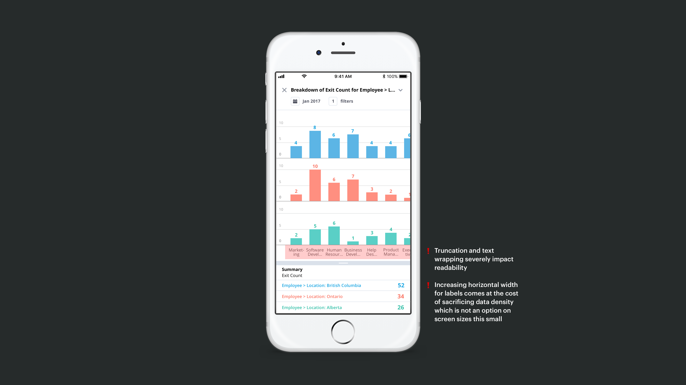

The main advantages of the horizontal orientation for non-time data are:

- It handles labels of any length elegantly.
- More data density without sacrificing readability. You can decrease the height of each bar significantly before the grouping labels are affected.
- Mobile advantage. Since horizontal space is scarce on mobile, the horizontal orientation allows us to fit a greater number of bars in a single view.

It becomes obvious that the vertically-oriented bar chart is useful for a handful of very specific analyses - showing magnitude over time. Luckily, we have conventional abbreviations for time periods that prevent the length of labels from becoming unmanageable.

### Guiding the analysis
By constraining the x-axis for this visual to time, users are effectively guided towards creating visuals that are both resilient and reflect their analytical intent rather than generating custom charts. **This design decision further solidifies our principle that the app is not a custom chart builder, but a way for users to answer their business questions.**

We also decided to prevent the user from creating “meaningless charts,” such as a 100% stacked bar without a secondary grouping. We did this by hiding the option to normalize the height of the bars in cases where the user had not added a secondary grouping.

## Trend breakdown as a first-class visualization

[[wideImage]]
|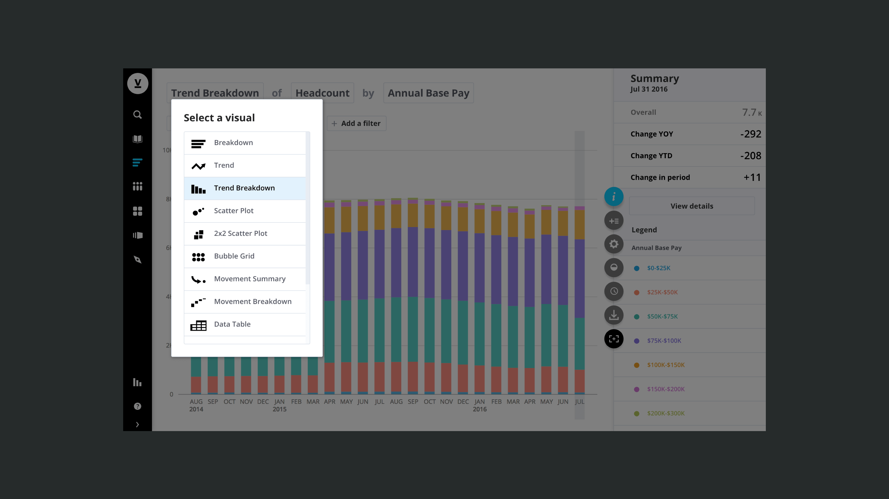

The decision to add this visual as an entry point in the app’s primary visualization picker also builds upon the principle mentioned above. Naming the visual "Trend Breakdown" reflects the analytic intent rather than the form factor itself. 

An alternative user flow that was considered was to allow users to arrive at this visual by selecting time as a grouping from the horizontal breakdown visual. The app could then automatically switch from horizontal to vertical orientation.

[[wideImage]]
|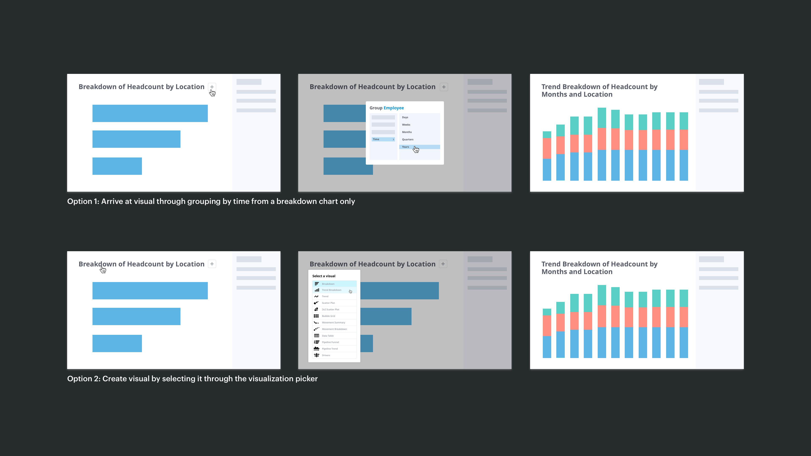

The reasons we discarded the first approach were:

1. It would conflate two distinctly different analytical intents.
2. The Trend Breakdown chart would become less discoverable.

If this visual were to be accessible only through the horizontal bar chart, we would be effectively communicating to the user that workflows in our app are related on the basis of similar chart types, rather than the questions they hope to answer.

However, allowing the first interaction in addition to the second would offer the user the flexibility by adding an additional entry point to arrive at their intended visual. In the end, we proposed the viz picker as the primary entry point, and the interaction shown in the first option as a separate entry point.

## Switching between analytical intents

Once we settled on where the Trend Breakdown would live inside our app, I mapped out how the visual would behave in relation to other visuals. This was done to ensure a seamless experience when the user switches between visuals to further explore their questions.

[[wideImage]]
|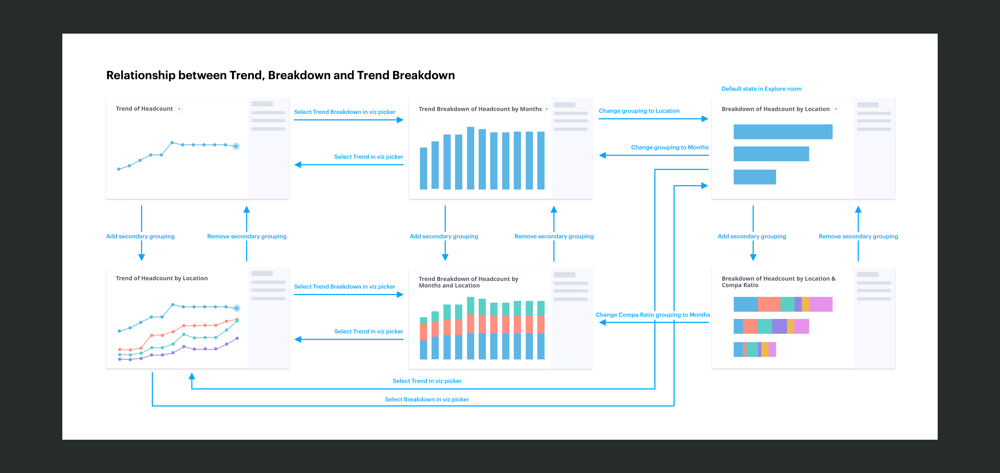

The user’s selected metric and groupings persist between visuals.
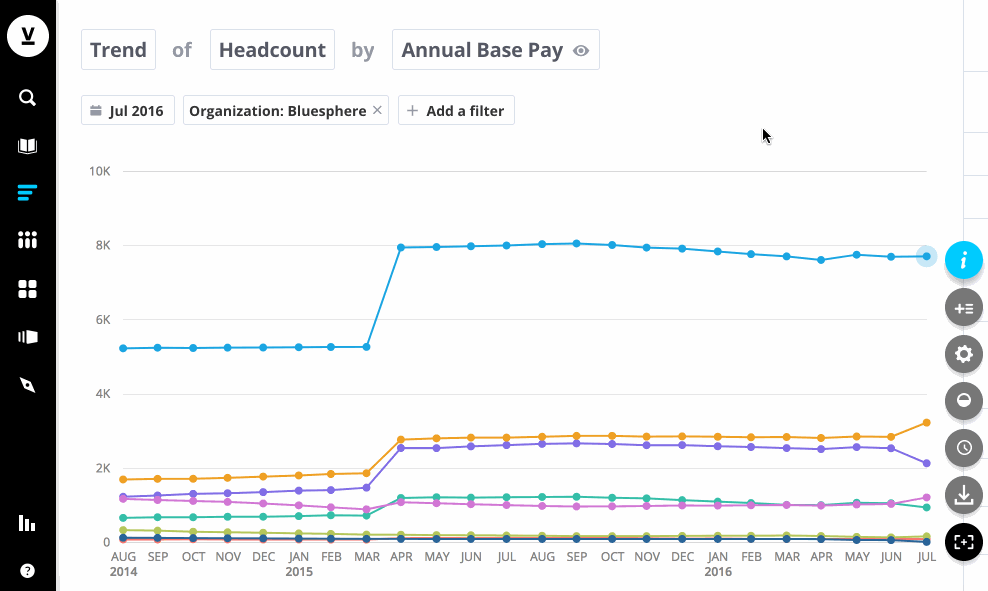

## Mobile interactions

Visier’s mobile app is primarily focused on consumption, rather than authoring new content. The goal of the mobile design is to make consumption of your content easy. Although users can’t ask completely new questions about their data on mobile, they can still drill into their existing data and filter it by time.

By default, the latest time period is selected because users are often most interested in the current value of a metric.

## Handling different data types

[[wideImage]]
|

## Static cursor

[[wideImage]]
|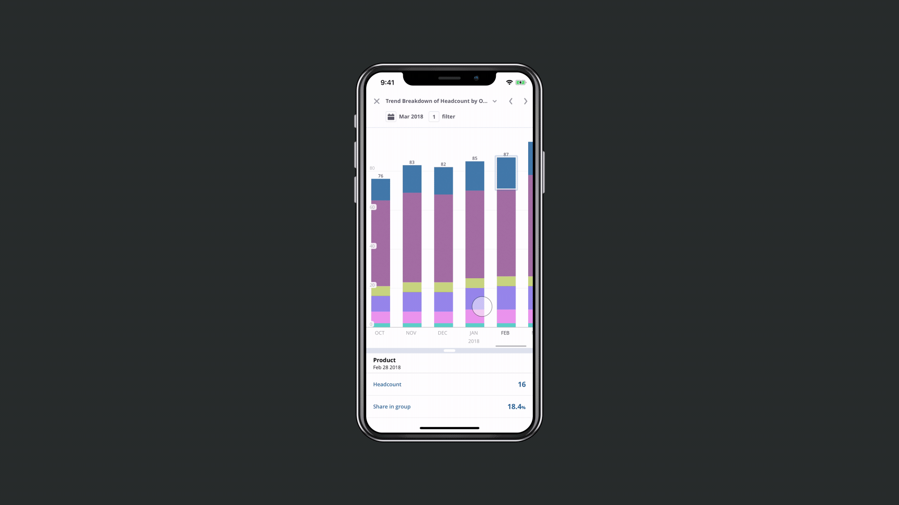

Because the data points can get arbitrarily small, selection on mobile is always a challenge. With a static cursor, a user doesn’t have to be as precise with their selection of a data point as they can just swipe to explore their chart. The alternatives we considered were using the standard panning and tap to select a data point, which is commonly found in native iOS apps. However, with that approach, the user’s thumb must obscure the data point to select it, and it requires a certain amount of accuracy. In addition, since our data is not continuous, but aggregated at certain points in time, the static cursor reinforces that concept by binding the selection to the time periods.

This approach is especially useful when selecting stacked items on a chart, making it easy to quickly see the change of a particular category over time.

## Iterations on data point selection

[[wideImage]]
|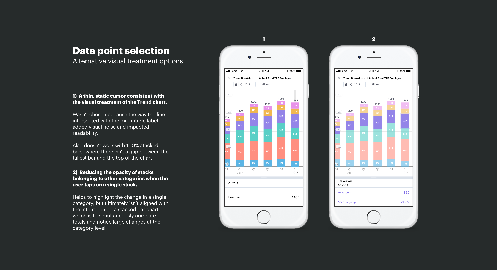

[[wideImage]]
|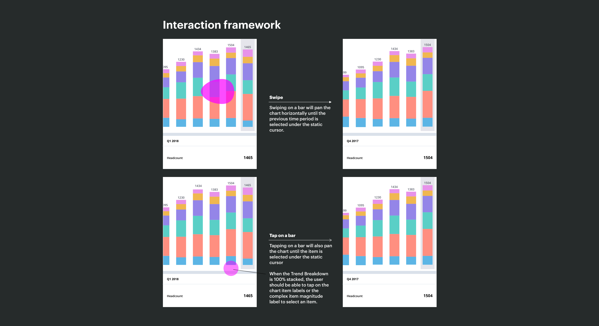

## Labels, labels, labels!
*How do you balance the need for data density against in-context labels?* There’s no question that labelling the data points in context of the visual is incredibly helpful for scanning the chart. However, when the visual becomes extremely dense, the priority becomes revealing the full history of data. The user is still able to the precise magnitude by selecting the item and reading the info panel.

[[wideImage]]
|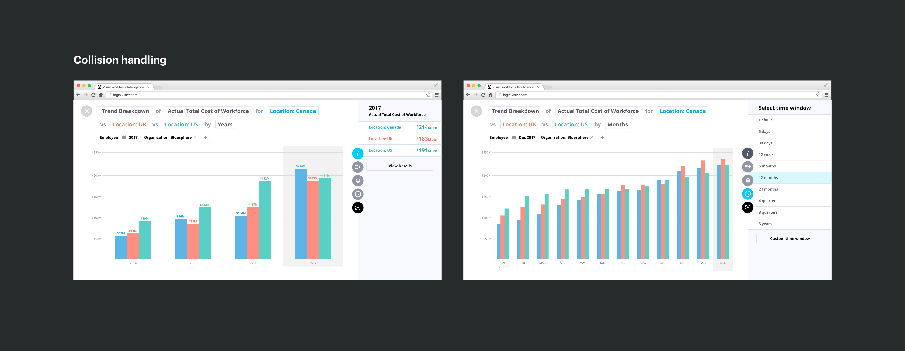

After doing an environmental scan on how other platforms handle labelling small data points, I decided on hiding the labels when the stacks became too small. Alternative options, such as reducing the font size or labelling the magnitude using a whisker interfered with the readability and added noise to the visual.

[[wideImage]]
|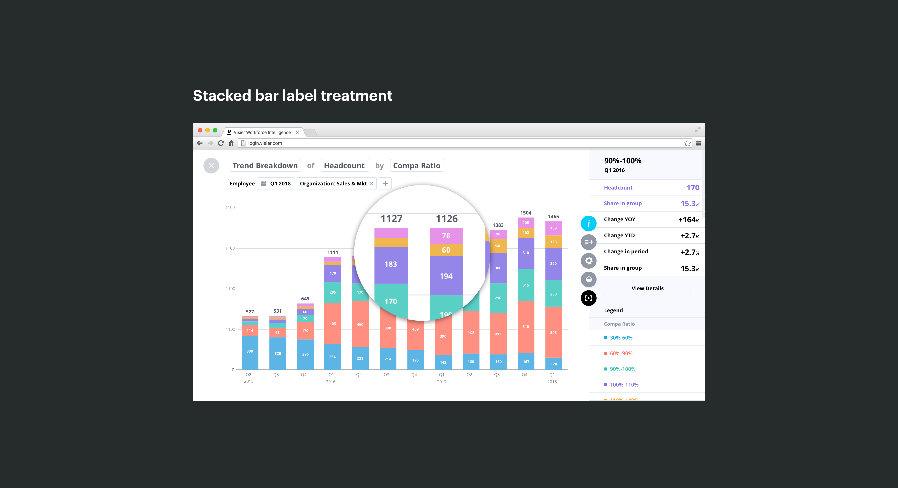

## Card view vs full screen

After defining the labelling rules for the full screen experience, I began to explore how the card view at various sizes would work. The principle behind the card view is that it’s the first step of a progress reveal. Although it’s interactable with data tips on hover, the user primarily relies on it to quickly understand what they’ve captured when they are navigating their saved charts. As a result, not all the details of the visualization are shown.

[[wideImage]]
|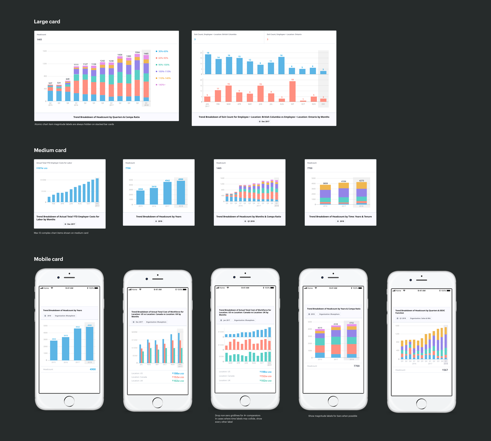

I explored changing the visual treatment of the y-axis tick labels for the full screen view. By fixing the tick labels on the screen with a semi-transparent background, the visualization can fill the edges of the screen - making the full screen experience feel immersive.

[[wideImage]]
|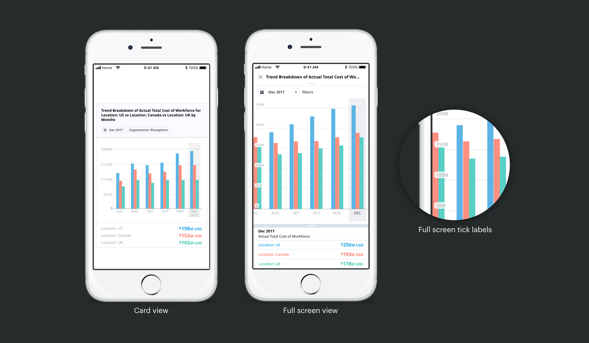

## Takeaways

Designing for the data analytics domain has trained me to be rigorous with covering all the possible states and user inputs. Data comes in all forms, and with that amount of variation and complexity, you need to have all your bases covered. Going deep in your explorations, often times beyond what you’re immediately tasked with, can pay off in helping the development team accurately estimate the amount of work involved. Even after you think you’ve accounted for all the types of data and edge cases, be prepared for an engineer to approach you with innocent questions that could turn out to be unexplored design problems.

Contrary to what UX case studies on Medium seem to convey, the reality is that design teams will always be working with less resources and time than we would prefer. Sometimes, the time for what’s considered “sufficient” user validation may not be factored into product releases.

I learned to cope with the uncertainty surrounding the lack of immediate user validation in a few ways:

- By actively seeking out those on my team with deep domain experience for feedback
- Absorbing as many established best practices about data viz and interaction design as I could from books and articles
- User research with coworkers

Conditions will never be ideal, how you respond to those conditions will define the outcomes of the project.

Thanks for reading! 😊
